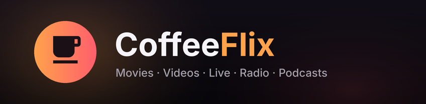

<p align="center">
  
</p>

# CoffeeFlix – the all-in-one entertainment app for the Wii U

**CoffeeFlix** puts your movies, videos, live streams, music, radio, podcasts, photos and comics in one fast, animated app built for the TV and the GamePad.

- 📺 **YouTube**: trending, music, gaming and more, plus search, subscriptions and watch history. Plays in up to 720p with hardware H.264 decoding.
- 🍿 **Jellyfin**: your own movie and TV server. Sign in with Quick Connect or a password. Includes continue watching, next up, libraries, seasons and episodes, direct play or transcoding, server subtitles, and resume that syncs back to the server.
- 🟣 **Twitch**: live channels, search and a local follow list, at your chosen quality (60 fps optional).
- 📻 **Radio**: over 40,000 stations from radio-browser.info, by country and genre, with favorites and live "now playing" titles.
- 🎙️ **Podcasts**: search the Apple Podcasts directory and top charts, subscribe to shows, and resume episodes where you left off.
- 📁 **My Media**: videos (with thumbnails, resume and `.srt` subtitles), music (folder queues, embedded and folder cover art), photos (zoom, pan, slideshow), and comics and books (CBZ, PDF, EPUB) from the SD card.
- 🖧 **Network shares**: browse and play from a Windows PC, Mac, Samba or NAS share (SMB 2/3).
- 📡 **Media servers (DLNA)**: Plex, Jellyfin, Emby, minidlna and most NAS boxes are found automatically on your network, no setup needed.
- 🔎 **Search everything** at once, with a **Home** screen that pulls it all together.
- 🎵 **Now Playing** with a live spectrum visualizer, and a mini player that keeps music going while you browse.
- ✨ **Juicy UI**: spring animations, blurred backdrops, focus zoom, sound effects, five accent colors, a startup animation and a screensaver. The console won't dim or power off mid-movie.

> DRM-protected services (Netflix, Disney+, Spotify and similar) can't run on the Wii U and aren't supported.

---

## 📦 Installation

1. [Download the latest release](https://github.com/roastedd/coffeeflix/releases/latest), or grab `coffeeflix-<commit>` from the latest [Build](https://github.com/roastedd/coffeeflix/actions/workflows/build.yml) run.
2. Extract the ZIP file to the **root of your SD card**.
3. Put your own media into `sd:/wiiu/apps/coffeeflix/` (the app creates `Videos`, `Music`, `Photos` and `Books` folders there).
4. Launch **CoffeeFlix** from the Wii U Menu (Aroma).

**or**

<p align="left">
  <a href="https://hb-app.store/wiiu/coffeeflix">
    
  </a>
</p>

### Connecting your services

- **Jellyfin**: open *Jellyfin* and enter your server address, e.g. `http://192.168.1.20:8096`. Then approve the Quick Connect code in the Jellyfin app on your phone, or type your password.
- **Network shares**: open *My Media → Network shares → Add share*. Enter the computer's IP address (or `\\host\share`), the share name and your login. Leave the login empty for guest shares.
- **Media servers (DLNA)** show up by themselves under *My Media → Media servers* once DLNA sharing is on in the server.
- **YouTube, Twitch, radio and podcasts** work without an account. Subscriptions, follows and favorites are stored on your SD card.

---

## 🎮 Controls

The GamePad, Pro Controller, Classic Controller and Wii Remote (with pointer) all work. The GamePad touch screen works too: tap to select, drag to scroll.

| Button | Everywhere |
|--------|------------|
| `D-Pad` / `Left Stick` | Move around |
| `A` | Select |
| `B` | Back; at the top of a section it opens the sidebar, and again goes Home |
| `X` | The action shown at the bottom right: favorite, subscribe, follow, remove |
| `+` | Open *Now Playing* while music or radio plays in the background |

| Button | Video player |
|--------|--------------|
| `A` | Play / pause |
| `D-Pad ←/→` | Back / forward 10 s |
| `L`/`ZL`, `R`/`ZR` | Back / forward 30 s |
| `Y` | Subtitles |
| `X` | Audio track |
| `D-Pad ↑/↓` | Show the controls |
| `B` | Close |

| Button | Now Playing |
|--------|-------------|
| `A` | Buttons on screen (previous, play/pause, next, stop) |
| `L` / `R` | Back 15 s / forward 30 s |
| `B` | Back (music keeps playing) |

| Button | Photos |
|--------|--------|
| `D-Pad ←/→`, `L`/`R` | Previous / next photo |
| `A`/`ZR`, `ZL` | Zoom in / out (`D-Pad` pans when zoomed) |
| `Y` | Slideshow |
| `B` | Back |

| Button | Reader (CBZ, PDF, EPUB) |
|--------|-------------------------|
| `D-Pad ←/→`, `L`/`R`, swipe | Previous / next page |
| `A`/`ZR`, `ZL` | Zoom in / out |
| `D-Pad`, `Left Stick`, drag | Pan when zoomed, scroll in fit width |
| `Y` | Fit page / fit width |
| `B` | Reset zoom, then back |

The reader reopens every book on the page where you stopped.

---

## ⚙️ Settings

Accent color, interface sounds, screensaver delay, streaming quality for YouTube, Jellyfin and Twitch, 60 fps streams, default subtitles, your region (used for trending and radio), connection security, and Jellyfin sign-out. Everything is saved to `sd:/wiiu/apps/coffeeflix/coffeeflix.json`.

---

## ⚙️ Compatibility tips

The Wii U decodes **H.264 in hardware** (up to 1080p); everything else is decoded in software. For the smoothest local playback, re-encode other formats:

```bash
# 720p – plays everywhere
ffmpeg -i <input> -map 0 -c:v libx264 -profile:v high -level 3.1 -pix_fmt yuv420p \
  -preset medium -crf 21 -vf "scale=-2:720" -c:a aac -b:a 192k -c:s copy <output>.mkv

# 1080p
ffmpeg -i <input> -map 0 -c:v libx264 -profile:v high -level 4.0 -pix_fmt yuv420p \
  -preset medium -crf 20 -vf "scale=-2:1080" -c:a aac -b:a 256k -c:s copy <output>.mkv
```

- **Video**: H.264 (hardware), plus HEVC, VP8/VP9 and MPEG-1/2/4 in software (best at 480p or lower).
- **Audio**: MP3, AAC, FLAC, Vorbis, Opus, ALAC, WavPack, WAV and AC-3/E-AC-3. Surround is downmixed to stereo.
- **Subtitles**: embedded SRT/ASS/WebVTT/mov_text, and `.srt` files next to the video.
- **Jellyfin** direct-plays what the Wii U can decode and asks the server to transcode the rest to H.264/AAC at your quality setting.

---

## 🛠️ Building

Every push is built by GitHub Actions ([`.github/workflows/build.yml`](.github/workflows/build.yml)); pushing a `v*` tag publishes a release.

To build locally you only need Docker:

```bash
tools/docker-build.sh            # first run also builds FFmpeg-wiiu, MuPDF and libsmb2 into deps/
tools/docker-build.sh DEBUG=1    # unoptimized build with debug logging
```

With devkitPro installed natively (`wut`, `wiiu-sdl2*`, `wiiu-curl`, `ppc-jansson`, `ppc-tinyxml2`, `ppc-giflib`, `ppc-libzip`, `ppc-libjpeg-turbo`), run `tools/build-deps.sh` once, then `make`. Without MuPDF in `deps/` the app still builds; the reader then opens comic books (CBZ) only.

To push a build to a Wii U running an FTP server: `WIIU_IP=192.168.x.x ./deploy.sh`.

### Desktop preview

The same code runs on macOS and Linux, which makes UI work much faster.

```bash
# macOS (Homebrew)
brew install pkg-config cmake sdl2 sdl2_ttf sdl2_image ffmpeg curl jansson tinyxml2 libzip
tools/build-deps.sh --host libsmb2   # once; add `mupdf` for PDF/EPUB in the reader
make -f desktop.mk -j8 run

# Linux
tools/build-deps.sh --host           # FFmpeg, MuPDF and libsmb2 for the host
make -f desktop.mk && ./build-desktop/coffeeflix
```

Without FFmpeg in `deps/host` the system's is used. Test files go in `data/media/` (`Videos`, `Music`, `Photos`, `Books`).

Keyboard: arrows move, `Enter`/`Z` = A, `Esc`/`Backspace`/`X` = B, `C` = X, `V` = Y, `Tab` = +, `Q`/`E` = L/R, `1`/`3` = ZL/ZR. Set `COFFEEFLIX_DATA=<dir>` to use a separate settings and media folder.

### Branding

`tools/make-branding.py` renders the icon, splash screens and store art from the app's own fonts and colors.

---

## 🙏 Credits

- 🛠️ **devkitPro, wut and the Wii U SDL2 port**: [devkitPro](https://github.com/devkitPro)
- 🎞️ **FFmpeg** and **FFmpeg-wiiu** (hardware H.264) by GaryOderNichts: [FFmpeg](https://github.com/FFmpeg/FFmpeg) · [FFmpeg-wiiu](https://github.com/GaryOderNichts/FFmpeg-wiiu)
- 📄 **MuPDF** (PDF/EPUB, AGPL): [GitHub](https://github.com/ArtifexSoftware/mupdf); Wii U hints from [hito16/mupdf-devkitppc](https://github.com/hito16/mupdf-devkitppc) and [SDLReader](https://github.com/hito16/SDLReader/blob/main/ports/wiiu/wiiu_time_utils.c)
- 🖧 **libsmb2** by Ronnie Sahlberg: [GitHub](https://github.com/sahlberg/libsmb2)
- 🔤 **Inter** by Rasmus Andersson (SIL OFL) and **Material Icons** by Google (Apache 2.0)
- 📻 **radio-browser.info** community station directory
- 💬 **stdout logger by dkosmari**: [GitHub](https://github.com/dkosmari/devkitpro-autoconf/blob/main/examples/wiiu/sdl2-swkbd/src/stdout.cpp)
- 🔔 **Boot sound**: [LightMister on Freesound](https://freesound.org/people/LightMister/sounds/769925/)

Made with ❤️ and ☕
